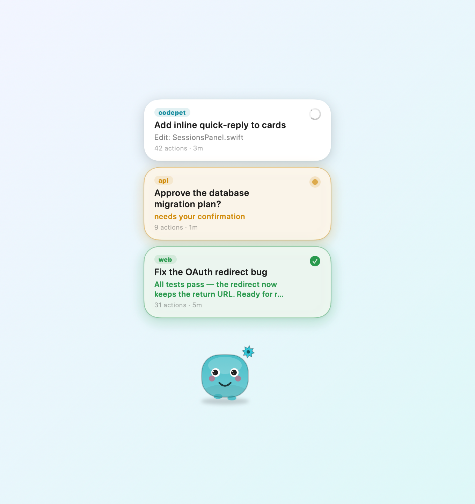
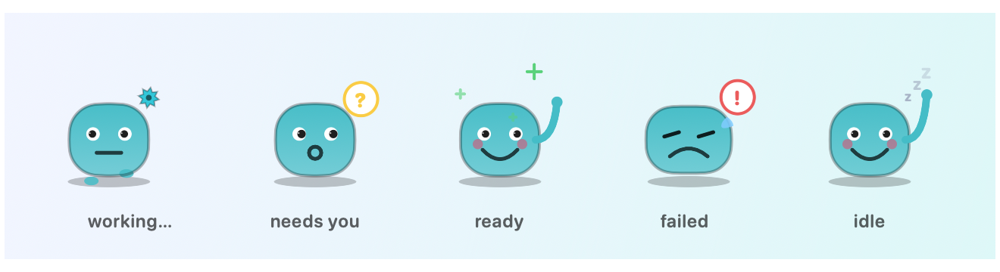
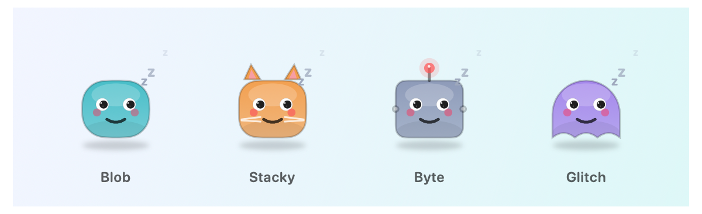

# 🐾 CodePet

[](https://github.com/JellyTony/codepet/actions/workflows/ci.yml)
[](LICENSE)
[](https://www.apple.com/macos/)
[](https://swift.org)

为 **Claude Code** 打造的原生 macOS 桌面宠物 —— 灵感忠实复刻自
[Codex pets](https://developers.openai.com/codex/app/settings)。一只会动的小动物住在屏幕角落,在你忙别的窗口时,一眼就能看出你的 AI 智能体在干什么。

> 🇬🇧 [English README](README.md)

<p align="center">
  
</p>

> 和 Codex pets 一样的理念、一样的角落浮层、一样的卡片堆叠布局 —— 但为 Claude Code 而生,并且 **多会话感知**。

## 亮点

- 🐾 **状态一眼可见** —— 角落小宠物实时反映 *工作中 / 需要你 / 待审查 / 失败 / 空闲*。
- 🗂️ **多会话感知** —— 每个 Claude Code 会话一张任务卡片,带真实任务标题、实时动作和进度。
- 💬 **卡片快捷回复** —— 不离开当前工作,直接把消息打回会话的终端。
- 🎨 **Petdex 图库** —— 两次点击装一只动画宠物,无需终端、无需配置。
- 🌏 **多语言** —— English / 简体中文 / 繁體中文 / 日本語,切换即时生效。
- 📦 **原生、零依赖** —— 单条 `swiftc` 构建,约 1 MB 的 App,无 Electron、无第三方包。

## 它能做什么

CodePet 浮在所有桌面(Space)之上、始终置顶、停在你选的角落。它把 Claude Code 的实时活动映射成一只会动的小宠物 + 一行简短进度提示 —— 就像 Codex 浮层一样:

| 状态 | 宠物表现 | 触发事件 |
|------|---------|---------|
| **工作中**(running) | 跑动、左右走、挥手、跳跃,齿轮转动 | `UserPromptSubmit`、`PreToolUse`、`PostToolUse`、`SubagentStop` |
| **需要你**(waiting) | 停下张望、抖动,`?` 气泡晃动 | `Notification` |
| **待审查**(ready for review) | 坐下微笑、捧着代码包、冒星星 | `Stop` |
| **出错了**(something failed) | 颤抖、皱眉、冒汗、`!` 气泡 | 工具报错 / 错误通知 |
| **空闲**(idle) | 呼吸、眨眼、飘 `z z z`、挥手打招呼 | `SessionStart` |

<p align="center">
  
</p>

底层每个渲染器都用一套命名好的 **`PetAction`(动作)** 说话 —— 正是这层抽象让 CodePet 能播放任何宠物(内置、Codex 或 Petdex)而无需为每只宠物写代码。动作集**就是** Petdex / Codex 的 9 行精灵图契约,顺序为:
`idle, walkRight, walkLeft, wave, jump, fail, wait, walk, review`(见
[`Action.swift`](Sources/CodePet/Action.swift))。

## 会话面板 —— 每个会话一目了然

在五个终端里同时跑 Claude Code,角落宠物也不会乱:CodePet **独立跟踪每个会话**,把它们叠成一摞白色任务卡片,浮在宠物正上方(Codex pet 的布局):

- **每张卡片一个状态灯** —— *工作中*转圈、*需要你*时琥珀色脉冲、*待审查*绿色打勾、*失败*红色三角。
- **真实的任务标题**(你最近发的那条消息 —— 斜杠命令会显示成 `命令: <目标>`)、所在**项目**、Claude **当前正在做什么的实时进度**(当前执行的动作),以及 **进度指标**(`编辑 · 42 操作 · 3分钟`)。
- **点击卡片**展开:完整任务文本、最近工具轨迹、工作目录,以及*在访达中显示*、*复制会话 ID*。
- **角落宠物显示聚合状态** —— 哪个会话最需要你就显示哪个(需要你 ▸ 失败 ▸ 待审查 ▸ 工作中 ▸ 空闲),菜单栏 **🐾 徽标** 显示有几个会话在等你。
- 它是**可交互的**:宠物眼睛会跟随光标、悬停时会精神一振,**点它**收起/展开卡片堆,**拖它**到任意位置 —— 卡片跟随,位置被记住。

## Petdex 图库 —— 在菜单里装宠物,无需终端

[Petdex](https://petdex.crafter.run) 是一个动画宠物图库,采用与 CodePet 相同的精灵图契约。**装一只只要两次点击** —— 无需终端、无需登录、无需配置:

> **🐾 → Pet(宠物) → 从 Petdex 安装 → 选一只。**

CodePet 会抓取图库、下载宠物的精灵图、写入 `~/.petdex/pets/<slug>/` 并立即切换过去。就这样。

更喜欢命令行?同一只宠物也能用官方 CLI(或其封装)安装,CodePet 会自动识别:

```bash
npx -y petdex install boba          # 或:node tools/petdex.js boba
```

…或让 Claude 执行 **`/codepet-petdex boba`**。以上任意方式都会把宠物放进 🐾 → Pet 菜单里的 **Petdex 图库** 分组,无需刷新或重启。

## Codex 格式兼容

Petdex 宠物就是 **Codex 宠物格式**,所以同一个加载器两者通吃。把 `pet.json` + 精灵图(`.webp` 或 `.png`;图集 `1536×1872`,8 列 × 9 行,`192×208` 每格)放进下面任一目录,即可原样渲染:

```
~/.petdex/pets/<slug>/{pet.json, spritesheet.webp}   # petdex install …
~/.codex/pets/<name>/{pet.json, spritesheet.webp}    # 你现有的 Codex 宠物
~/.codepet/pets/<name>/{pet.json, spritesheet.webp}  # 手动放入的宠物
```

同一只宠物若同时装在 `~/.petdex` 和 `~/.codex`,菜单里会去重为一条。内置**形象**完全不需要素材 —— Blob、Stacky、Byte、Glitch,以及程序员最爱的 **Ducky** 🦆(小黄鸭调试法)、**Rex** 🦖(离线小恐龙)、**Java** ☕(咖啡)—— 全部程序化绘制并动画,所有状态开箱即动。

<p align="center">
  
</p>

## 安装

### 下载安装(无需编译)

到 [最新 Release](https://github.com/JellyTony/codepet/releases/latest) 下载 **`CodePet.pkg`**,双击运行安装(若 macOS 拦截这个未签名安装器:右键 → 打开 → 打开)。安装器会把 CodePet 装到 `/Applications` 并启动;**首次启动时 App 会自动接好 Claude Code 的 hooks**。需要 macOS 13+ 和 [Node.js](https://nodejs.org)(hooks 用)。

### 从源码构建

```bash
git clone https://github.com/JellyTony/codepet.git
cd codepet
bash install.sh
```

它会编译 `CodePet.app`、把 Claude Code hooks 幂等地写进 `~/.claude/settings.json`(保留你已有的设置)、安装 `/codepet-hatch` 与 `/codepet-petdex` 技能并启动宠物。启动任意 Claude Code 会话,宠物会自动响应。

需要 macOS 13+ 和 Xcode 命令行工具链(`swiftc`)。

## 使用

- **点击宠物**:显示/隐藏会话卡片;**拖动它**:换位置;**拖右下角 ⤢ 手柄**(悬停时出现):缩放。
- **点击卡片**:把该会话的终端切到前台(自动识别 iTerm2 / Terminal / VS Code / Warp / Ghostty…);**右键**:在访达中显示、复制会话 ID、查看最近工具轨迹。
- **卡片快捷回复** —— 悬停某张卡片(或处于"需要你"状态的会话),底部出现回复框;打字回车,消息直接送进该会话的终端,无需切窗口。*(首次使用会请求 macOS「自动化」权限以控制你的终端。)*
- **菜单栏 🐾** —— 显示会话、切换形象、选择角落 / 吸附回去、切换**语言**(English / 简体中文 / 繁體中文 / 日本語 / 跟随系统)、预览状态。Pet 子菜单每次打开都会重新扫描已安装的宠物。徽标显示有几个会话需要你。
- **从 Petdex 安装宠物**,无需终端:**🐾 → Pet → 从 Petdex 安装**,选一只 —— CodePet 当场下载并切换过去。(命令行替代:`node tools/petdex.js boba` / `npx -y petdex install boba`,或让 Claude 执行 **`/codepet-petdex boba`**。)
- **孵化一只新宠物**(CodePet 版的 Codex `hatch-pet` 技能):

  ```bash
  node tools/hatch.js "Pixel" --form cat --color "#A385EB"
  ```

  …或直接让 Claude 执行 **`/codepet-hatch`**。然后菜单栏 🐾 → Pet。

## 卸载

```bash
bash uninstall.sh    # 移除 hooks + 技能、停止 App;保留你的宠物
```

**下载版(.pkg)**:把 `/Applications` 里的 CodePet 拖进废纸篓即可。想同时清掉 hooks/技能,删除前先运行:

```bash
node /Applications/CodePet.app/Contents/Resources/tools/install-hooks.js uninstall
```

你已安装的宠物(`~/.codepet`、`~/.petdex`)始终保留。

## 目录结构

```
Sources/CodePet/      Swift 应用(AppKit 浮层 + SwiftUI/Canvas 渲染)
  main.swift          NSPanel 浮层、菜单栏控制、面板装配
  PetWindow.swift     角落面板 + 交互容器(悬停/注视/拖动/点击)
  SessionsPanel.swift 白色任务卡片堆(每个活跃会话一张卡)
  Session.swift       每会话模型 + 注意力优先级
  ProjectResolver.swift  工作目录 → 项目名(识别 git 仓库根)
  StateStore.swift    跑 hook 服务器、监视 ~/.codepet/、计算聚合状态
  HookServer.swift    回环 HTTP 服务器 —— 接收 Claude Code 的 HTTP hooks
  HookProcessor.swift 事件 → 状态推断 + transcript 解析(应用内)
  TerminalFocus.swift 点卡片时把会话终端切到前台
  TerminalInput.swift 把快捷回复送进会话终端
  Action.swift        PetAction + SpriteContract —— Petdex/Codex 动画契约
  Behavior.swift      活动状态 → PetAction + 运动编排(走/挥手/跳/抖/失败)
  SpriteAtlas.swift   按 SpriteContract 加载 Petdex/Codex 精灵图(.webp/.png)
  VectorPet.swift     程序化绘制的动画宠物(眼睛跟随光标)
  PetCatalog.swift    从 ~/.petdex、~/.codepet、~/.codex、内置发现宠物
  PetdexGallery.swift 应用内 Petdex 浏览/安装器(菜单 → 从 Petdex 安装)
tools/
  codepet-hook.js     SessionStart 命令钩子 → 捕获终端身份
  install-hooks.js    安全、幂等的 settings.json 合并(HTTP + 命令钩子)
  petdex.js           从 Petdex 图库安装宠物
  hatch.js            创建一只新宠物
  make-icon.swift     生成应用图标
skills/hatch-pet/     Claude Code 的 /codepet-hatch 技能
skills/petdex/        /codepet-petdex 技能 —— 安装 Petdex 宠物
build.sh install.sh uninstall.sh package.sh
```

## 它如何与 Claude Code 通信

CodePet 通过 Claude Code 的 **hooks**(已文档化、稳定的集成契约)感知状态。为了不拖慢 Claude 的关键路径,两种 hook 传输按频率分开:

- **高频事件**(`UserPromptSubmit`、`PreToolUse`、`PostToolUse`、`Notification`、`Stop`、`SubagentStop`)走 **HTTP hook**:Claude Code 把事件 JSON 直接 POST 到 App 在 `127.0.0.1` 上跑的小型**回环 HTTP 服务器**(`HookServer.swift`),不必每次工具调用都起进程。App(`HookProcessor.swift`)在本地推断状态、解析 transcript 得到任务标题 + 实时摘要,全程在应用内、不占 Claude 的路径。App 没运行时 POST 会快速失败(非阻塞)并被忽略。
- **`SessionStart`** 是一次性的**命令钩子**(`codepet-hook.js`),以便从其进程环境变量里捕获终端身份(`TERM_PROGRAM` / `ITERM_SESSION_ID`)—— 这正是"点卡片 → 切到那个终端"能工作的原因。

回环服务器只绑定 `127.0.0.1`(机外不可达),并由安装时写入 hook 请求头的共享令牌(`~/.codepet/hook.json`)保护。两种传输都由 `install-hooks.js` 幂等地写进 `~/.claude/settings.json`。

## 状态文件

App 为**每个会话**在 `~/.codepet/sessions/<id>.json` 写一条记录(外加一个兼容旧版的 `~/.codepet/state.json` 记录最近事件),监视该目录(文件系统事件 + 每秒轮询),并清理 6 小时未动的会话。卡片堆只显示**活跃**会话(工作中 / 需要你 / 待审查 / 失败);空闲和陈旧会话会隐藏以保持专注。

```json
{
  "session_id": "…",
  "state": "running",
  "detail": "Edit",
  "cwd": "/path/to/project",
  "title": "你交代的任务",
  "summary": "Claude 刚说它在做什么",
  "prompt": "你最近的一条消息",
  "last_tool": "Edit",
  "recent_tools": ["Read", "Grep", "Edit"],
  "tool_count": 42,
  "term_program": "iTerm.app",
  "started_at": 1782490700.0,
  "updated_at": 1782490847.2
}
```

`state` ∈ `idle | running | waiting | ready | failed`。

## 贡献

欢迎提 Issue 和 PR —— 构建配置、项目结构和规范见 [CONTRIBUTING.md](CONTRIBUTING.md),也请阅读[行为准则](CODE_OF_CONDUCT.md)。

CodePet 刻意保持小巧、零依赖:单条 `swiftc` 构建,无 SwiftPM/Xcode 工程,无运行时包。

## 许可证

[MIT](LICENSE) © 2026 JellyTony。

CodePet 为独立项目,与 Anthropic、OpenAI 无关。"Claude Code" 与 "Codex" 为各自所有者的商标。
